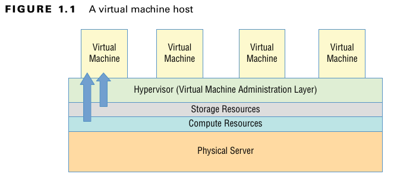
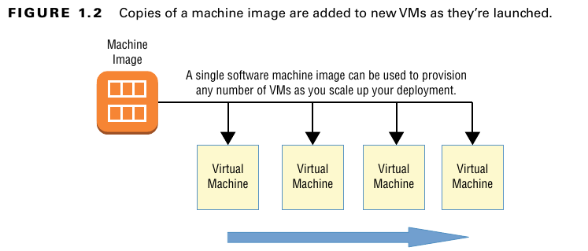
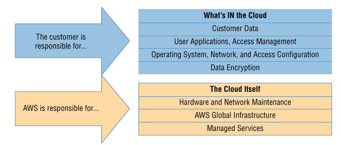

#### Virtualization
 - the core tecnology of all cloud operations
 -  divide the hardware resources of a single physical server
into smaller units
 - host multiple virtual machines (VMs)

#### Cloud Computing Optimization
 - Scalability
    - adicionar / remover mais VMs para dar conta de um pico de acessos, por exemplo 
 - Elasticity
    - aumentar/reduzir capacidades da VM de acordo com necessidade
 - Cost Management
    - capital expenditure (capex) framework into something closer to operational expenditure (opex)
        - custo operacional próximo ao custo total para montar infra
    - alocação de recursos de acordo com necessidade (e gastos variáveis)
    - não se expor a gastos de infra enquanto não for necessário

#### The AWS Service Categories
| Category | Function | 
| -------- | ----- | 
|Compute| similar to local physical servers (+autoscaling, load balancing, containers, serverless architectures) | 
|Networking | connectivity, access control, and remote connections| 
|Storage | Various kinds of storage platforms |
|Database | Data solutions for relational, NoSQL, or caching |
| Application management |Monitoring, auditing, and configuring AWS account services and running resources |
|Security and identity | managing authentication and authorization |

#### AWS Platform Architecture
 - servidores espalhados ao redor do mundo
    - impacto em latência
    -  compliance with regulations (particular legal jurisdiction)
    - orgizados em AWS Regions
        - sem relação com regiões físicas do mundo
        - cada região possui, pelo menos, 2 Availability Zones (AZs), separadas geograficamente
- Edge Network Locations
    - regiões mais próximas aos usuários
    - objetivo: oferecer baixa latência para serviços
    - ex.: Amazon CloudFront, Amazon
Route 53, AWS Firewall Manager, AWS Shield, and AWS WAF.
- Serviços organizados dentro de Virtual Private Clouds
(VPCs)
    - espaço de rede subdividido em subnets
    - associado com AZs
    - isolamento efetivo recursos e replicação

#### The AWS Shared Responsibility Model
 - AWS possui uma série de medidas legais associadas, mas algumas partes ficam sob resposabilidade do usuário
 - Responsibility model:
    - AWS: 
        - secure and uninterrupted operation of its "cloud"
        - physical servers, storage devices, networking infrastructure, and managed services.
    - customer: 
        - responsible for whatever happens within that cloud
        - The way you decide to use AWS resources is your business
- dependendo do modelo de Cloud usado (IaaS, PaaS) as responsabilidades de cada um variam
